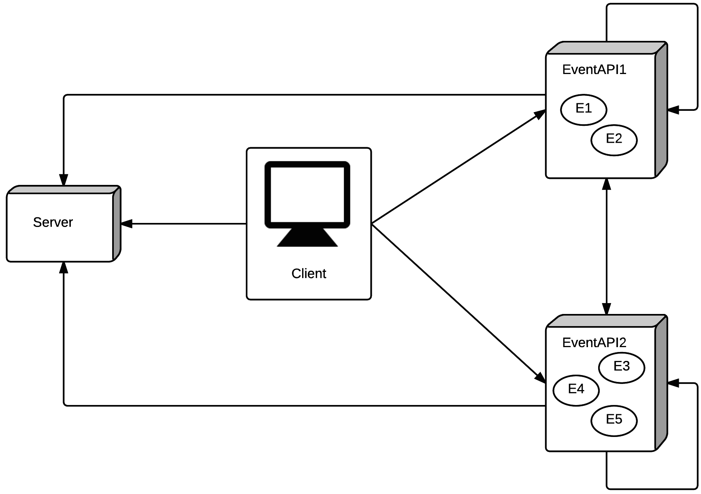
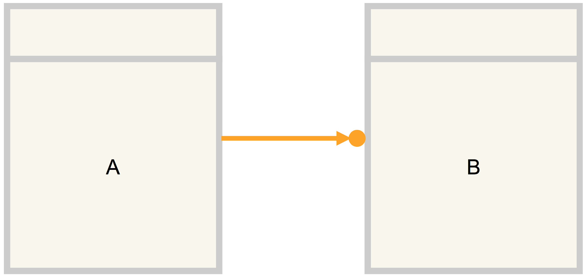
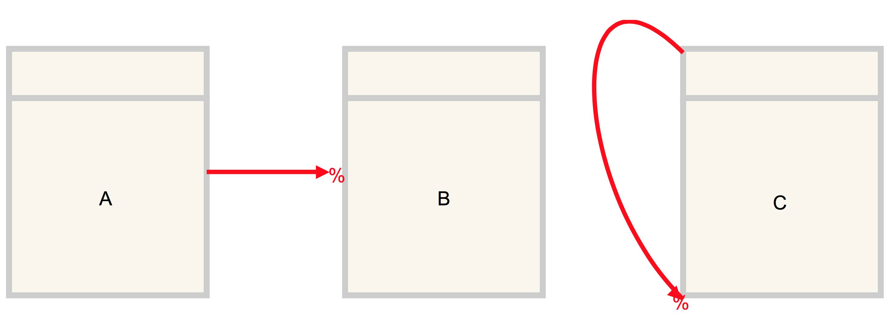
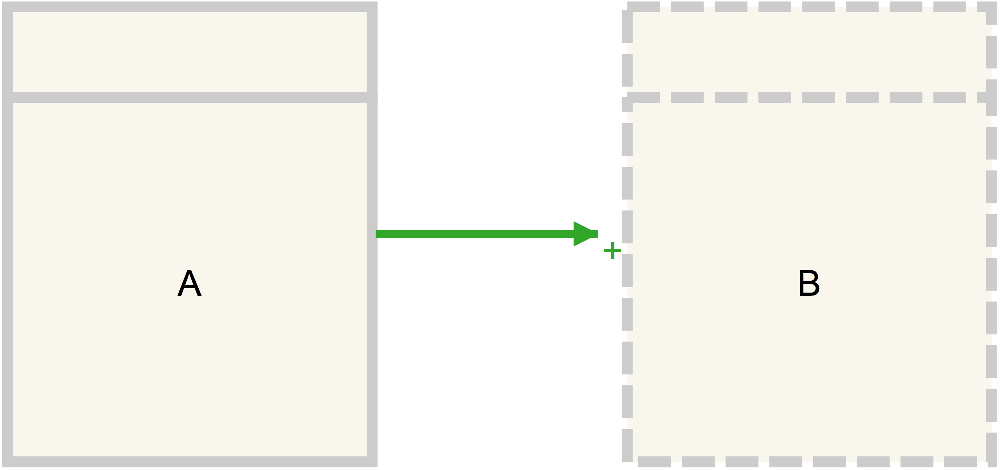
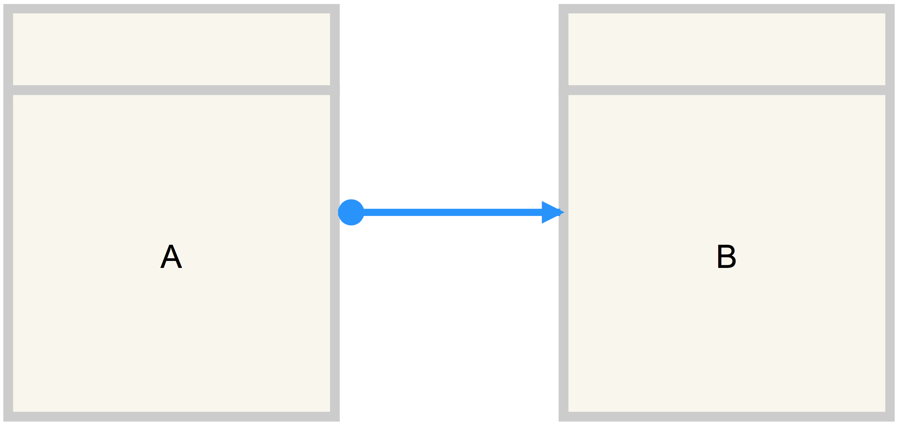

# Second Year Project - FlowIT
This system supports the parsing and execution of DCR graphs in a distributed system. The system has been deployed to several Microsoft Azure instances, and supports concurrent execution of events. 

The project was developed in the course Software Development in Large Teams with International Collaboration at the IT University of Copenhagen in collaboration with a Brazilian hospital in order to support their provided patient workflow.  

## Architecture

The following has been implemented in the final system:

- A peer-to-peer architecture which can be distributed across an arbitrary number of web services.
- The workflow system is generic in the sense that it supports not only a single, built in workflow. Furthermore a workflow is able to dynamically change while it is running.
- Workflow events have location transparency; events can be held at different servers or at the same server. The internal logic does not differ across locations.
- A graphical user interface that provides a more appealing user experience for the end user to interact with.
- History, enabling the user to see a log of what happened at both the Server and at a single event.
- Persistence, if the machines running the Server or an EventAPI are shut down, once restarted they will be able to restore from where they left off.
- Role-based access control, which ensures that a user is only able to execute events that the given user has permission to.
- Locking prevents simultaneous access to events. Simultaneous access could otherwise cause a corrupted state in a workflow.

## Implementation
The Visual Studio solution contains nine different Visual Studio projects:

- A Client project, containing a Windows client which is used for interacting with the workflows and events.
- A Server project, containing a Server which stores information about workflows.
- An Event project, containing an EventAPI which stores, handles, and simulates a number of events.
- Furthermore the solution has a DCR graph parser which is only meant to be used for debugging and administration. The graph parser is therefore not tested or documented.
- Besides these projects, a Common project is used for shared classes.
- Four test projects that test the Client, Server, EventAPI and Common subsystems respectively.

Microsoft Azure has been chosen as the web hosting solution for the Server and EventAPI projects.

### Main parts 
The system contains three main parts:

#### Client
The client is the software an end user will typically interact with when using the system. The user uses the Client to execute events in a workflow, reset a workflow, or see a history of what happened at the events and at the Server. The Client interacts with the Server and possibly several EventAPIs.

#### Server
The Server is a centralized instance that holds information about all workflows. For each work- flow it provides the addresses of all events in the given workflow. The Server is contacted by the Client, when the Client wants to know what workflows exist at the Server and know what events are related to a specific workflow.

Furthermore, the EventAPI also interacts with the Server, when an event wants to add itself to an already existing workflow at the Server. The Server is intended to be a REST-based service.

In the current setup, the Client has no way of discovering the Server automatically, and hence the Client is hardcoded to the address of the Server, stored in a configuration file. It is possible to have multiple Servers, however a workflow must be located at a single Server. Furthermore a Client can only contact one server per instance.

#### EventAPI
The EventAPI holds events and is responsible for the execution of events. The Client will con- tact the EventAPI when asking for the state of events. The EventAPI contacts the Server when events are created or deleted. EventAPI is a REST-service.

### Design

#### Concurrency Control
Two major solutions to concurrency control are in use in software today: pessimistic concurrency control (PCC) and optimistic concurrency control (OCC).
PCC uses the concept of locking which prevents multiple transactions from accessing shared data simultaneously. OCC on the other hand uses a working copy of shared data to carry out a transaction and the changes are validated before possibly committing. If a transaction discovers a conflict between itself and a concurrent transaction, the implementation will decide which transaction aborts.

PCC has ultimately been implemented in the system.

#### Interface-based Programming
This section presents how the team decided to let the system architecture be structured around interface-based programming.
At the drafting of the initial system architecture, strict boundaries of the responsibility of mod- ules were a clear goal. Using interfaces to specify functionality of a component and only exposing the interface to other components of the system helps in achieving the desired separation. 

#### Dependency Injection
Dependency injection hence allows for injecting different implementations of the same interface. A major motivation for using dependency injection was not to inject different implementations during runtime, but instead for the team to mock dependencies when unit testing classes.

#### ASP.NET WebAPI
ASP.NET WebAPI has been used to implement the web services Server and EventAPI. ASP.NET WebAPI uses Controllers, which are objects that handles incoming HTTP requests. In the following, Controller should hence not be confused with a Controller as found in the Model-View-Controller design pattern.

#### Multi-layered Design
We have based our architectural design of Server and EventAPI on a multi-layered approach. With a multi-layered approach the team achieved separation between classes - low coupling - and independence among classes - high cohesion. 

Each layer has a distinct responsibility, and provides its service to the layer above it.

## Compiling the Project
The team has strived for making it as easy as possible for the user to be able to run the programs and start the two web service projects EventAPI and Server.

To be able to compile the project the user is required to have Microsoft Visual Studio 2013 installed. Open the BNDN solution file and choose “Build Solution” from the “BUILD” menu.
When compiled, the client can be run by right clicking the Client project, choosing “Debug”, and then “Start new instance”.
When compiled in Debug mode, the EventAPI will contact a localhost Server when needed. When compiling in Release mode, it will contact the Azure hosted Server. 

### Running the Client
When first compiled, the Client will automatically be set to contact the Server running in Azure. Just double click the Client.exe - found in <Handin folder>/CompiledClient/ - with the Flow icon to start the program.

#### The Login Window
The first thing shown to the user is a login window. When the application is run for the first time the Username and Password fields will be empty with a watermark that states what the fields are used for.
Each workflow has the user Admin, which can execute all events.

### DCR Graph Parser
The team did not want to issue every HTTP request manually every time a workflow should be created in the system, and a simple DCR graph parser was therefore developed.
The parser can upload workflows and events to the Server and EventAPIs. The program was developed as an internal tool, and as such not a tool designed for "shipping". It might be useful if anyone wants to try out another workflows than the ones provided. 
The parser will not handle failures.

### Running Locally
From Visual Studio it is possible to host the EventAPI and Server locally. In order to make the EventAPI contact the local Server, the Solution Configuration must be set to Debug. If the configuration is set to Release, the EventAPI will contact the hosted Server instead.
Visual Studio is set up to start an instance of the Server and EventAPI if they are not running already. 
The server is then running, and the DCR Graph Parser or Client can be started.

## Requirements
- The system is able to handle generic DCR graphs and the logic they follow. This is to be tested on a DCR graph produced from a workflow of a Brazilian hospital and a DCR graph given by the lecturers of the course.
- The system must be able to create, reconfigure, and delete workflows.
- The architecture of the system must resemble a peer-to-peer distribution.
- The implementation should be based on REST services.
- The system should provide a simple graphical user interface (UI) to the user.
- The UI should be able to present an event log or history, that describes which operations have been executed, aborted or changed in a given workflow.
- The system must persist data such that it can be restarted and handle isolated occurrences of crashes.
- The system must implement concurrency control that ensures that an illegal state cannot be reached.
- The system must implement role based access control (RBAC) that ensures that a user is only able to make changes that the given user has permission to make.
- The system must allow reconfiguration of already existing events and their relations. This can be achieved by deleting and then recreating the individual events.

The system does not provide a UI for creation of DCR graphs. The team recommends the use of http://www.DCRGraphs.net
It is not in the scope of the project to support nested events on a workflow as is possible in the full specification of DCR graphs.
No handling for restoring the system after crashes has been implemented.

## Testing

A variety of testing approaches have been used to test the system during development. These include unit, integration, system, and acceptance testing in varying degrees. Acceptance testing has been applied after some initial tests were developed.

A testing evaluation was performed nearing the end of the project to decide on which modules should be tested, and in which order. Some components play a larger role than others in the system and have therefore been put through more scrutinising tests.

The coverage analysis tool JetBrains DotCover assisted in this by providing coverage analysis and an overview of the test coverage.

## DCR Graphs
DCR Dynamic Condition Response Graphs (DCR graphs) enables the creation of non-linear workflows. A detailed explanation of DCR graphs can be seen here (LINK).

DCR graphs present an alternative notation to the notation of standard flow-oriented processes.

### Relations
Relations describe constraints among events. There are 4 basic relations, explained in the following section.

####Condition
This relation states that to execute the event B, event A must be executed or excluded first.

####Exclude
An exclusion relation states that once event A has been executed, the Included boolean of event B must be set to false, such that event B is excluded. Note that an event may exclude itself, meaning once the event has executed, the Included value of the event must be set to false such that it is excluded. 

####Include
This relation states that event A includes event B. This means that after the execution of event A, the Included value of event B must be set to true, such that event B is included.

####Response
The response relation states that once event A is executed, event B is expected to be executed eventually. Once event A has been executed, the Pending value of event B must be set to true.

Therefore for an event to be executable, the Included value must be true, and each of its condition relations must be either excluded or executed.
Furthermore an execution of an event leads to its Executed and Pending values to be set to true and false respectively. 
Each of the executed events’ response relations must have their Pending value set to true, each of their inclusion relations must have their Included value set to true, and their exclusion relations must have their Included value set to false.

The three concepts: state, events, and relations, are be mirrored in the system.

 	

