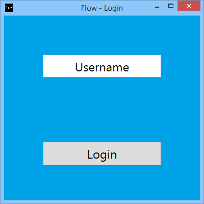
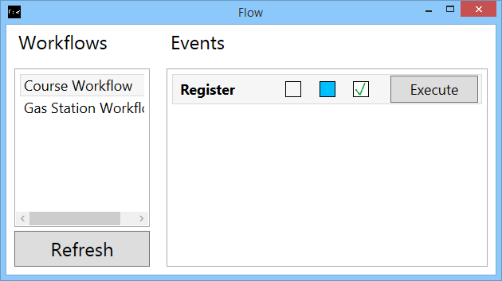

# Instructions
## Client
In order to start up the Client, double-click on the Client.exe-file with the Flow-icon.

### Windows and elements

The first window that is shown is the Login.  
In this windows type in your username and click on the Login-button. (See picture below).

If the username is correct and corresponds to a user on the Workflow-Server the login will succeed and the user will be presented with a new window which is the main Flow window.

In the main Flow window the user is presented with a list of workflows to the left. If nothing is shown, and the user is sure that a workflow should be present, the Refresh-button can be pressed.

The Refresh-button is also used to see changes in workflows, so if the Workflow-Server is updated with a new workflow, the user must press Refresh to see the new content.

When a workflow is selected, the right part of the window is updated. This part of the window shows the events of the current workflow.

The information shown is collected from the Event-server itself, so some information might take a while to receive. When the title of the Event is shown, the Event has been loaded.

For every event is a title, a few status-boxes and a Execute-button.

The title is the users way of identifying the Event. There is no rules about naming of the Events, so two Events could in theory have the same name. We do not encourage it though.

The three status-boxes consists of Pending, Included and Executed.

The Pending-box has a red exclamation-mark when the Event is Pending. An Event is Pending if another Event has marked it as such when executed. This means that this is the expected action to take when the other Event has been fulfilled. An Event is Pending until it has been either executed or excluded.

The Included-box is blue whenever the Event is included. An Event can be included which means that it is currently possible to execute the Event when all of its conditions has been fulfilled. It can also be excluded which means it is not possible to execute the Event until another action makes it included again.

The Executed-box marks if an Event has been executed at least once for this workflow.

The Execute-button tells the Event to execute, which effectively means that it marks itself as executed (if possible) and tells all of its neighboring Events to update their state according to the rules of the workflow.

The button is active only if the Event is executable, which means it must be included and all of its conditions must be executed at least once.

### Settings file
The client creates a settings file, where a few informations are saved.

It is possible to use the settings file to change the URL of the Workflow-Server, which means it is possible to point the client to a different Workflow-Server if desired.

The settings file also remembers the username of the last successful login, so the user can login without writing the username every time.
