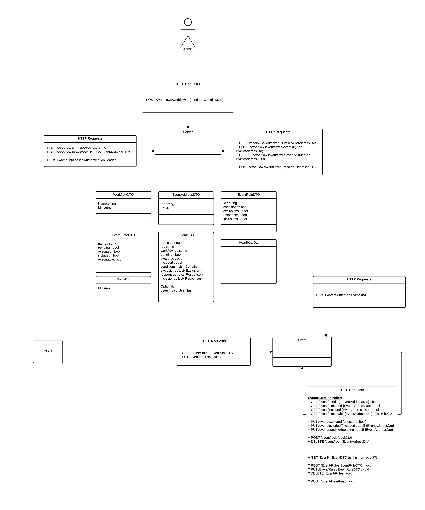

# Pre-handin 

**IT-University of Copenhagen, April 9th, 2015**

**Group-members:**

- Adam William Engsig
- Anders Fischer-Nielsen
- Anders Wind Steffensen
- Cecilie Strunge Jensen
- Mikael Lindemann Jepsen
- Morten Albertsen

# Introduction

This report describes the software, that was designed and built by the group during the project.

As a brief introduction, the purpose of the system is to "construct a generic workflow system", that enables users (through a Windows-client) to get an overview of and execute the events within a workflow. An "event" is here a part / step of a workflow. 

The project hence is concerned with implementing the software within the Windows-client, the Events and a central Server, that acts an intermediate between the Client and the Events. The three parts must be implemented such that they run in a distributed fashion. 

# Implemented workflow

This section describes the workflow, that has been implemented in the delivered system. The workflow was based at a textual description, provided by the external partner in Brazil. 

The workflow concerns medical care and treatment at a hospital. 

We have deliberately decided to simplify and omit certain parts of the given workflow. This was done, so the group could focus at implementing core-functionality first, before moving on to more complex workflows. The group hopes to be able to support more complex workflows is the second part of this project. 

The workflow, that is implemented in the delivered software, is seen in the illustration below, and generated through the online-tool available at [DCRGraph.net](www.dcrgraph.net)

<!--Inser illustration: missing!-->

# How to run the system

This section describes how to run the provided software; namely the Windows Client ("Client"). 

## Server
The Server needs not be started, since it is already running online, and Client is targeting that service. 

## Event

## Client
In order to start up the Client, double-click on the Client.exe-file (located at \??\??) with the Flow-icon.

### Understanding the user-interface

The first window that is shown is the Login-window (see picture below)  
In this windows type in your username and click on the Login-button.

For username, use the role, you wish to access the system with; for instance, if you wish to access the workflow as a doctor, supply **doctor** as your username. 

If the username is correct and corresponds to a user on the Workflow-Server the login will succeed and the user will be presented with a new window which is the main Flow window.

In the main Flow window, the user is presented with a list of workflows to the left. If nothing is shown, and the user is sure that a workflow should be present, the Refresh-button can be pressed.

The Refresh-button is also used to see changes in workflows, so if the Workflow-Server is updated with a new workflow, the user must press Refresh to see the new content.

When a workflow is selected (in the left pane), the right part of the window is updated. This part of the window shows the events of the current workflow.

The information shown is collected from the Event-server itself, so some information might take a while to receive. When the title of the Event is shown, the Event has been loaded.

For every event a title is shown (Register in picture above), a few status-boxes (described below) and an Execute-button.

The title is the user's way of identifying the Event. There is no rules about naming of the Events, so two Events could in theory have the same name. We do not encourage it though.

The three status-boxes represents the state of the given Event; from left to rigt: Pending, Included and Executed.

The Pending-box has a red exclamation-mark when the Event is Pending. An Event is Pending if another Event has marked it as such when executed. This means that this is the expected action to take when the other Event has been fulfilled. An Event is Pending until it has been either executed or excluded.

The Included-box is blue whenever the Event is included. An Event can be included which means that it is currently possible to execute the Event when all of its conditions has been fulfilled. It can also be excluded which means it is not possible to execute the Event until another action makes it included again.

The Executed-box is checked if an Event has been executed at least once for this workflow.

The Execute-button tells the Event to execute, which effectively means that it marks itself as executed (if possible) and tells all of its neighboring Events to update their state according to the rules of the workflow.

The button is active only if the Event is currently executable, which means it must be included and all of its conditions must be executed at least once.

### Settings file
The client creates a settings file (located at \??\??), where a few informations are saved.

It is possible to use the settings file to change the URL of the Workflow-Server, which means it is possible to point the client to a different Workflow-Server if desired.

The settings file also remembers the username of the last successful login, so the user can login without writing the username every time.	

# System architecture

This section provides a birds-eye view of how the system was implemented and what parts is was broken down into. 

To fulfill the requirements of the project, three subsystems are created: a central server ("Server"), a client ("Client) and events ("Event"). The three subsystems are described in the following section.

<!--
-->
### Central Server
The central Server functions as a RESTfull WebAPI, where Events can hook up onto (an existing) Workflow and the Client can retrieve a list of Workflows and related Events. The Server subsystem is implemented in C# using the ASP.NET WEP API framework

### Client

The main functionality of the Client subsystem is to provide the users an overview of Workflows and Events on the workflows, and provide the user with a way to send an Execute call to a specific event.
The Client is implemented in C# using the .NET framework WPF for GUI components. The client has a connection submodule which handles all outgoing calls to both the Server and events.

### Event

The Event subsystem is implemented in C# using the ASP.NET WEP API framework, which allows for easy routing and setup of a RESTful WebAPI. An Event also have submodules which controls all outgoing calls to the Server and to the events which (the Event) is related to. 
The implementation of Event allows for multiple Events to be stored at either, the same machine or be distributed across network and multiple machines or a combination of the two first. 

# Testing

This section describes how the group has tested the system and includes a discussion of to what extent we believe the software works as intended. 

A variety of testing approaches have been used to test the system during development. 
These include unit-, integration-, system- and acceptance testing in varying degrees. Acceptance testing has also been applied after the inital tests were developed.

## Unit Testing
The major components handling data that have been developed by the team (not Microsoft's libraries) have been unit-tested to ensure that their functionality was correct. 

The unit-tests can be found (and run) within the provided Visual Studio-solution in a project following the naming-convention:

$$<TargetProject>.tests$$

for instance the project *Server.tests* contains the unit-tests of Server. 

### Server
The unittests on Server are found in the Server.tests project (in the provided Visual Studio solution)

The WebAPI controller and server logic classes have been unit tested as follows:

#### IServerLogic 
ServerLogic is the implementation of the IServerLogic interface, and has therefore been tested according to the methods specified in this interface. 
Mocking has been used extensively (using the Moq nuGet package) to ensure that the logic was tested in an isolated and controlled environment. 
The logic saves data to an instance of IServerStorage, which is mocked to enable testing. Every method in this interface is mocked, and saves and retrieves data from an in-memory List using callback methods.

#### WorkflowsController
Mocking is used to test the implementation of the WorkflowController class - again to test in a controlled environment. 
An IServerLogic instance is mocked and returns a List of elements when a method is tested. 
Incoming HTTP requests are handled by the WorkflowsController and therefore methods handling GET, POST, PUT and DELETE requests have been tested using a IServerLogic mock. 
  
### Event
The unit-tests concerning Event are located in the Event.tests project (in the provided Visual Studio solution)

The outgoing communicator, WebAPI controller and event logic classes have been unit tested as follows:

#### EventCommunicator
The EventCommunicator should throw certain expections when receiving invalid requests. This has been tested for methods in the IServerFromEvent interface.

#### EventLogic
EventLogic is the implementation of the IEventLogic interface. The methods in this interface have been unit tested by creating an in-memory instance of IEventStorage and testing against this. 
Assertions for expected results (including exceptions) is used to test that methods return the expected results. 

#### EventStateController
The locking functionality of Events has been tested using unit testing and assertions for expected results. 

### Client
The unittests on Client are located in Client.tests projects (in the provided Visual Studio-solution)

The connection of the Client to the Server has been unit tested as follows:

#### ServerConnection
The ServerConnection inherits from the IServerConnection interface and the methods defined in this interface have been unit tested.
An instance of HTTPClientToolbox is mocked to ensure that the ServerConnection can be tested in an isolated environment. 
Testing that the correct exceptions are thrown on invalid requests and correct data is returned on valid requests is done by assertion.

## Integration Testing
Formal test cases have been specified, but have not been evaluated formally. 
Most functionality has been tested throughout development, but test results have not been written down due to time pressure. Getting the system to "just work" after unit testing was completed, has been main focus for the team. 

## System Testing
System testing has not yet been formally completed. 

## Acceptance Testing
Acceptance testing would preferrably be done by the receiver/user of the system using test cases specified either by the client or the developers. 
Acceptance testing has not been done yet, due to time-pressure. 

## Discussion of testing-approach 

The team's testing approach has mainly been centered around unit-testing. 

It has not been able to carry out acceptance-testing with external partners as of yet. 

The group's confidence in the system is currently restricted to a per-module level, due to time-pressure. 

# Conclusion

The delivered software at this point provides a basis for the projects second part. 

# Questions regarding workflow in Brazil
